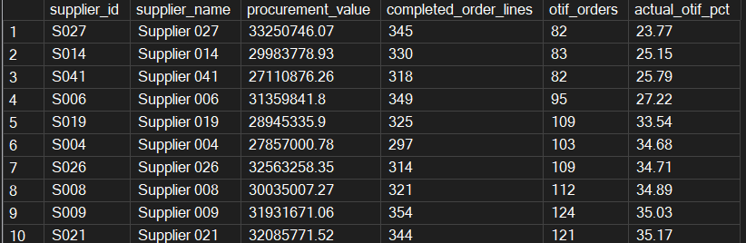
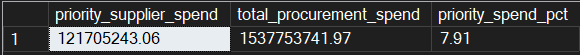
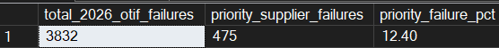

# Procurement & Supplier Performance Analysis

## Project Overview

This project uses SQL Server to analyse procurement activity, supplier performance and delivery reliability within a supply chain business.

The aim is to assess data quality, measure supplier delivery performance and identify areas of procurement exposure that may require further investigation.

The project follows an end-to-end SQL workflow covering data profiling, cleaning, validation, business analysis and final result reconciliation.

## Business Problem

The procurement and operations teams are concerned about supplier delivery reliability and potential supply chain risk. However, the specific suppliers, products or operational areas contributing to these issues are not yet known.

The analysis uses the available purchase order data to identify performance patterns, assess supplier exposure and highlight areas for further investigation.

## Dataset

The project uses four related datasets:

- `purchase_orders` – purchase order line-level transactional data
- `suppliers` – supplier information, including region and agreed performance targets
- `parts` – part and product information
- `warehouses` – warehouse reference information

The purchase order dataset contains 18,012 rows across 6,000 purchase orders and covers the period from January 2025 to August 2026.

## Tools

- SQL Server
- SQL Server Management Studio (SSMS)
- GitHub

## Analysis Process

The project follows five stages:

1. **Data profiling** – reviewed the datasets for missing values, duplicates, unmatched IDs, invalid dates and unusual quantities.
2. **Data cleaning** – created a reusable SQL view containing cleaned IDs and analysis eligibility flags while retaining the original values.
3. **Data validation** – confirmed row counts, duplicate handling, reference-table matches and procurement totals.
4. **Business analysis** – analysed supplier spend, OTIF performance, monthly trends, warehouse performance and part-category exposure.
5. **Final validation** – reconciled the headline results before reporting the findings.

## Key Findings

- The analysis covers **6,000 purchase orders**, **17,975 eligible order lines** and approximately **£1.54bn** in procurement spend.
- Overall on-time, in-full delivery performance is **37.37%**, with 6,162 of 16,487 eligible completed order lines meeting OTIF.
- **S027, S014, S041 and S006** have the four lowest supplier OTIF rates, ranging from **23.77% to 27.22%**.
- These four suppliers account for approximately **£121.7m**, or **7.91%**, of total procurement spend.
- They account for **12.40% of failed OTIF order lines in 2026**, which is higher than their share of spend.
- Their OTIF performance drops sharply from January 2026.
- Spend with these suppliers covers all six part categories, with the highest values in **Mechanical, Cold Chain and Electrical**.
- Warehouse OTIF ranges from **35.91% to 38.25%**, suggesting that poor performance is not limited to one warehouse.

### Supporting Results

**Lowest supplier OTIF performance**



**Priority supplier spend**



**Priority suppliers' share of 2026 OTIF failures**



## Recommendations

- Review delivery performance with S006, S014, S027 and S041, focusing on the sharp decline from January 2026.
- Give additional attention to Mechanical, Cold Chain and Electrical because these categories have the highest spend with the four suppliers.
- Investigate whether any supplier, contract or operational changes occurred around January 2026.
- Continue monitoring OTIF by supplier and month to identify whether performance improves.
- Use additional supplier and operational data before deciding on the underlying causes or taking corrective action.

## Data Quality and Cleaning

Data profiling identified several issues in the purchase order data:

- 25 records had a missing supplier ID.
- 25 records referenced supplier S999, which was not present in the supplier master.
- 25 records had a missing part ID.
- 185 records had a received date before the order date.
- 25 records had a missing received date.
- 25 records had a non-positive ordered quantity.
- 25 records had a received quantity greater than the ordered quantity.
- 12 duplicate copies were identified.

The original records were retained. Cleaned supplier and part IDs were created, and eligibility flags were added to control which records could be used in spend, quantity and delivery analysis.

After applying all three analysis checks, **17,765 records** were fully eligible. Spend analysis used **17,975 order lines** because a valid delivery date is not required to calculate procurement value.

## How to Run the Project

1. Create a SQL Server database for the project.
2. Import the four CSV files from `data/raw` into tables named:
   - `purchase_orders`
   - `suppliers`
   - `parts`
   - `warehouses`
3. Run the SQL scripts in the following order:

```text
01_data_profiling.sql
02_data_cleaning.sql
03_data_validation.sql
04_business_analysis.sql
05_final_validation.sql
```

The cleaning script creates the `purchase_orders_clean` view used by the validation and analysis scripts.

## SQL Skills Demonstrated

- Data profiling, cleaning and validation
- Joins and aggregate functions
- `CASE` expressions and conditional aggregation
- Common table expressions (CTEs)
- Window functions, including `LAG()`
- Trend analysis and result reconciliation

## Limitations

- The available data identifies when and where OTIF performance declined but does not explain the underlying cause.
- Additional information, such as supplier communications, transport delays, contract changes and operational incidents, would be needed for root-cause analysis.
- OTIF is measured at purchase order-line level, so the results do not represent the percentage of complete purchase orders delivered on time and in full.

## Conclusion

The analysis identified four suppliers with the lowest OTIF performance and a clear decline from January 2026. Together, these suppliers represent £121.7m in procurement spend and 12.40% of failed OTIF order lines in 2026.

The findings support a focused supplier review, particularly across Mechanical, Cold Chain and Electrical. Further operational information would be required to understand the reasons for the decline and decide on appropriate action.